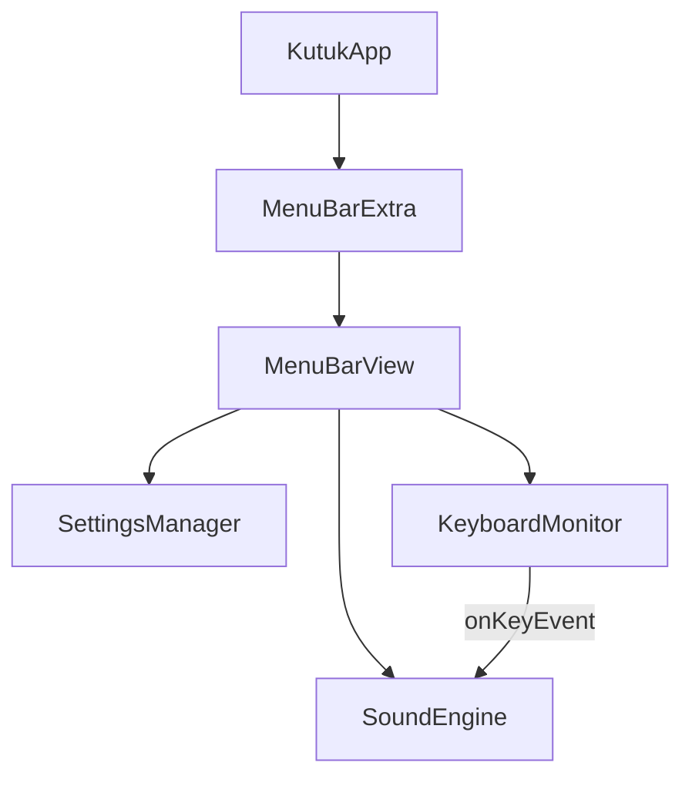

# Kutuk – Implementation Reference

> Mechanical keyboard sound app for macOS

---

## Architecture



---

## File Structure

```
kutuk/
├── kutukApp.swift              # App entry, MenuBarExtra scene
├── Info.plist                  # LSUIElement=true (no dock icon)
├── kutuk.entitlements          # App sandbox
├── Models/
│   └── SoundPack.swift         # KeyType, KeyEvent, single-pack SoundPack struct
├── Services/
│   ├── SoundEngine.swift       # AVAudioEngine, polyphony pool
│   ├── KeyboardMonitor.swift   # CGEvent tap, key classification
│   └── HotKeyManager.swift     # Global hotkey (currently disabled)
├── Settings/
│   └── SettingsManager.swift   # UserDefaults persistence
├── Views/
│   ├── MenuBarView.swift       # Main dropdown UI
│   └── OnboardingView.swift    # Permission request
└── Resources/
    └── Sounds/                 # Cherry MX Blue MP3 files
```

---

## Key Components

### kutukApp.swift
- Uses `MenuBarExtra` for menu bar presence
- No `init()` code (causes crashes on early NSApp access)
- No dock icon via `Info.plist` LSUIElement

### SoundEngine.swift
- `AVAudioEngine` with 8 `AVAudioPlayerNode` pool
- Polyphonic playback for fast typing
- Random pitch (±5%) and volume (±10%) variation
- **Important**: Don't call `loadSoundPack()` in `init()` – causes crash

### KeyboardMonitor.swift  
- `CGEvent.tapCreate()` with `.listenOnly` option
- Key classification: regular, space, enter, backspace, modifier
- Permission check via `AXIsProcessTrusted()`
- **Important**: Don't call `checkPermission()` in `init()` – keep init empty

### SettingsManager.swift
- `@Published` properties with `UserDefaults` backing
- `SMAppService` for launch at login (macOS 13+)

---

## Sound File Convention

```
{pack-id}_{key-type}_{event}_{variation}.mp3
```

Examples:
- `cherry-mx-blue_regular_press_1.mp3`
- `cherry-mx-blue_regular_press_5.mp3`
- `cherry-mx-blue_regular_release.mp3`

Pack: `cherry-mx-blue`

Key types: `regular`, `space`, `enter`, `backspace`, `modifier`

Events: `press`, `release`

The bundled Cherry MX Blue pack uses Mechvibes `mxblue-travel` audio. It ships
five regular press variations and one regular release sound; special key types
fall back to the regular press/release sounds through `SoundPack.soundURLs`.

---

## Crash Debugging Notes

| Issue | Cause | Fix |
|-------|-------|-----|
| Crash at `start()` | `NSApp.setActivationPolicy()` in App init | Remove from init |
| Crash at `start()` | `loadSoundPack()` in SoundEngine init | Defer to view appear |
| Crash at `start()` | `checkPermission()` in KeyboardMonitor init | Defer to view appear |
| Self capture error | Using `[self]` in struct closures | Use weak references |

---

## Build & Run

```bash
# Command line
xcodebuild -project kutuk.xcodeproj -scheme kutuk build

# Or in Xcode
# 1. Open kutuk.xcodeproj
# 2. ⇧⌘K to clean
# 3. ⌘R to build and run
```

---

## Future Enhancements

| Feature | Priority | Notes |
|---------|----------|-------|
| Global hotkey (⌥⌘K) | High | Re-add HotKeyManager properly |
| Per-app disable rules | High | Exclude Zoom, music apps |
| Focus Mode integration | Medium | Auto-disable during DND |
| Custom sound imports | Medium | User-provided WAV/MP3 |
| App Store submission | Low | Icons, screenshots, metadata |
