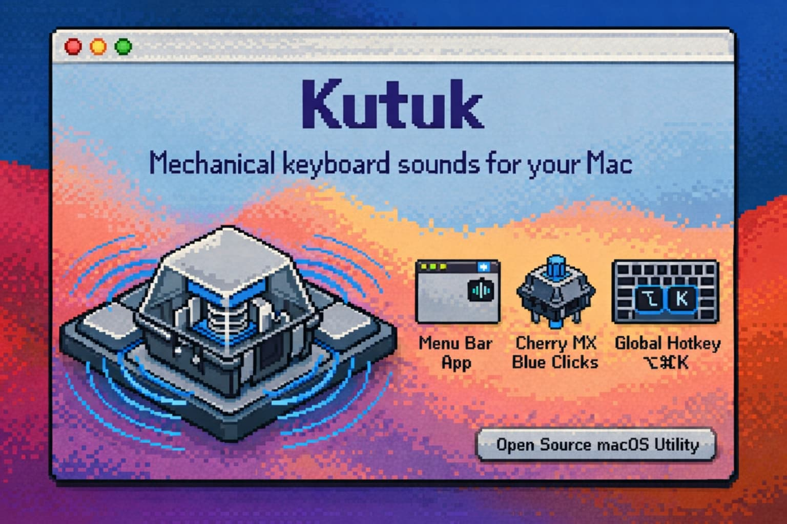

# Kutuk

Mechanical keyboard sounds for your Mac. Kutuk plays satisfying Cherry MX Blue click sounds as you type, running quietly in your menu bar.

<p align="center">
  
</p>


## Features

- Cherry MX Blue mechanical keyboard sounds with natural variation
- Universal Binary: runs natively on both Apple Silicon and Intel Macs
- Menu bar app with no dock icon clutter
- Global hotkey toggle (default: Option+Command+K)
- Volume control and sound pack selection
- Launch at Login support

## Install

### Download

Grab the latest DMG from [Releases](https://github.com/irajul/kutuk/releases), open it, and drag **Kutuk.app** into Applications.

### Important: First Launch

Since Kutuk is not notarized (it's a free open-source app), macOS Gatekeeper will block it. You need to remove the quarantine attribute before the first launch:

```bash
xattr -cr /Applications/Kutuk.app
```

Then open the app normally. You'll also need to grant **Input Monitoring** permission when prompted (System Settings > Privacy & Security > Input Monitoring).

### Build from Source

```bash
git clone https://github.com/irajul/kutuk.git
cd kutuk
make build        # Build the app
make dist-app     # Create ad-hoc signed distribution
make dmg          # Create DMG installer
```

Requires Xcode 16+ and macOS 14+.

### Versioning

Kutuk uses a checked-in versioning script so local releases and CI builds stay in sync.

To update the app version and automatically increment the local build number by 1:

```bash
make bump-version VERSION=1.0.2
```

To increment only the build number:

```bash
make bump-build
```

If needed, you can also set an explicit build number while changing the app version:

```bash
make bump-version VERSION=1.0.2 BUILD=5
```

Release builds set the final build number from GitHub Actions, so shipped artifacts always get a monotonically increasing CI build number.

## Usage

Once running, Kutuk appears as a small icon in your menu bar. Click it to:

- Toggle sounds on/off
- Adjust volume
- Switch sound packs
- Configure the global hotkey
- Set launch at login

## Permissions

Kutuk requires **Input Monitoring** permission to detect keystrokes. It listens in read-only mode and never records, stores, or transmits any keystrokes. You can verify this in the source code — the event tap uses `.listenOnly` mode.

### Granting Permission

1. When prompted, click **Grant Input Monitoring** in the menu
2. Toggle Kutuk **ON** in System Settings > Privacy & Security > Input Monitoring
3. Click **Restart to Apply Permission** in the menu (macOS requires a restart for the permission to take effect)

### Troubleshooting: Multiple Entries in Input Monitoring

If you rebuild from source, macOS may create duplicate Kutuk entries in Input Monitoring. To clean up, open System Settings > Privacy & Security > Input Monitoring, select each old entry, click the **minus (−)** button to remove it, then re-add the current app.

## Contributing

See [CONTRIBUTING.md](CONTRIBUTING.md) for development setup and guidelines.

## License

[MIT](LICENSE)
